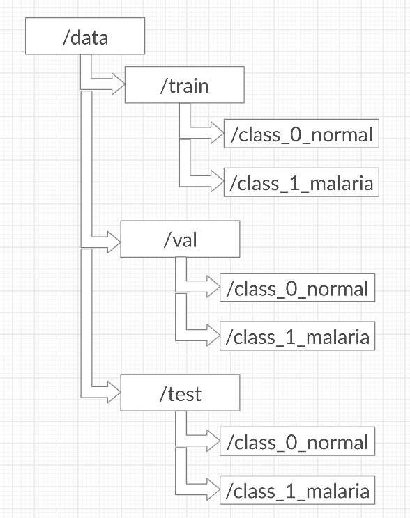

# Malaria-Classification

## Overview

Malaria is a mosquito-borne infectious disease that affects humans and other animals. Malaria causes symptoms that typically include fever, tiredness, vomiting, and headaches. In severe cases it can cause yellow skin, seizures, coma, or death.Malaria 
is typically diagnosed by the microscopic examination of blood using blood films, or with antigen-based rapid diagnostic tests.
So, I've used segmented cells from the thin blood smear slide images to classify whether a person has malaria or not.
  

## Project Details

I have used Keras (an open source neural network library) to build this classifier. The model (Model.ipynb) contains a self-
made ConvNet (Convolutional Neural Network) that has around 4 convlutional layers, 4 Max Pool layers and 2 dense layers having 
'relu' activation unit. The last layer has the 'sigmoid' activation unit to classify  cell images having Malaria or not. It has around 336017 trainable parameters.

I have got around <strong>96% accuracy</strong> in the Test set.
  

## Dataset

The dataset contains two folders
<ul>
<li>Infected</li>
<li>Uninfected</li>
</ul>

And a total of 27,558 images.
  
Datatset Source : <strong>Kaggle</strong>

In order to use this model for this dataset, you have to organize the data in a particular format.

  

## Inspiration

Save humans by detecting Image Cells that contain Malaria or not
 

<h5>Copyright &copy; 2020 Akshit Sharma</h5>
